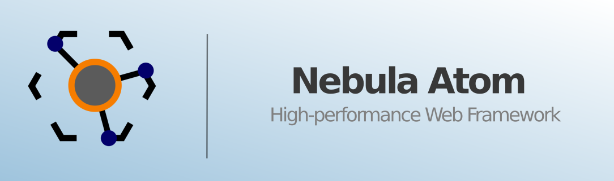
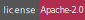

[][homepage]
[][compilers_versions]
[](LICENSE)
====

# Nebula Atom

## Introduction

Hello! Thank you for using this software, developed with a lot of effort and affection for the Free Software community.

## About this software

Nebula Atom is a C++ Web Framework for building high-performance APIs, supporting scalable architecture and modern web technologies.

## Features

Support for
- CMake
- C++17
- Docker
- CppCheck
- Conan
- Doxygen
- ccache
- cpack

## Requeriments

On Debian (11 and 12):

```shell
apt-get update && apt-get install -y \
      make \
      binutils \
      g++ \
      git \
      cmake \
      libssl-dev \
      libpoco-dev \
      libmariadb-dev \
      libyaml-cpp-dev
```

## Installation

- Download the source code

```shell
git clone https://gitlab.com/nebulacsf/software/main/nebula-atom.git
```

- Build and install

```shell
mkdir build && cd build
cmake ../ -DCMAKE_BUILD_TYPE=release && cmake --build .
cmake --build . --target install
```

## Documentation

**Work in progress!**

- Hello World example:

```cpp
#include "core/nebula_atom.h"
#include "handlers/custom_handler.h"
#include "http/request.h"

using namespace Atom;

int main(int argc, char** argv)
{
    Core::NebulaAtom app;

    app.CustomHandlerCreator_([&](Core::HTTPRequestInfo&)
    {
        return new Handlers::CustomHandler([&](Handlers::CustomHandler& self)
        {
            self.CustomHTMLResponse_(HTTP::Status::kHTTP_OK, "Hello!");
        });
    });

    return app.Init_(argc, argv);
}
```

## Contact

- **Gitlab**: [@nebulacsf](https://gitlab.com/nebulacsf/software/main/nebula-atom)
- **Github**: [@nebulacsf](https://github.com/NebulaCSF/nebula-atom)
- **Web**: [NebulaCSF](https://www.nebulacsf.com)
- **Email**: [NebulaCSF](mailto:support@nebulacsf.com)

## License

This project is under licence [Apache-2.0](http://www.apache.org/licenses/LICENSE-2.0) - see file [LICENSE](LICENSE) for more details

[homepage]: https://gitlab.com/nebulacsf/software/main/nebula-atom
[compilers_versions]: https://en.cppreference.com/w/cpp/compiler_support