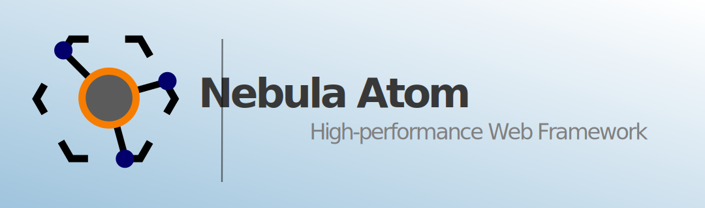
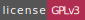

[][homepage]
[](https://github.com/nebulacsf/modern-cxx-project/releases)
[][compilers_versions]
[][compilers_versions]
[](LICENSE)
====

# Modern C++ Project

## Introduction

Developed, designed and made by the **Software Developers Team** of NebulaCSF | [NebulaCSF website](https://nebulacsf.com)

Hello! Thank you for using this software, developed with a lot of effort and affection for the Free Software community.

## About this software

Modern C++ Project is a project template for modern C++ projects.

## Features

Support for
- CMake
- C++17 C++11
- Docker
- Clang
- CppCheck
- Conan
- GoogleTest
- AppImage for Linux
- Doxygen
- ccache

## Requeriments

- CMake
- C++17 C++11
- Conan
- GoogleTest
- Git

## Installation

- Download the source code

```shell
git clone https://github.com/nebulacsf/modern-cxx-project.git
```

- Build and install

```shell
cd modern-cxx-project
mkdir build && cd build
cmake .. -Dproject-name_CONAN=ON
make
sudo make install
```

## How to use this software

- Open the binary executable

```shell
./src/project-name
```

## Documentation

**Work in progress!**

## Donations

If you want to help us financially we accept your donations using
Paypal and performing the following steps:

1. Access the following URL from your browser: [PayPal - NebulaCSF](https://paypal.me/nebulacsf)
2. Let yourself go ;)

## Contact

- **GitHub**: [@nebulacsf](https://www.github.com/nebulacsf)
- **Web**: [NebulaCSF](https://www.nebulacsf.com)
- **Email**: [NebulaCSF](mailto:support@nebulacsf.com)

## License

This project is under licence [GNU General Public License v3.0](https://www.gnu.org/licenses/gpl-3.0-standalone.html) - see file [LICENSE](LICENSE) for more details

[homepage]: https://hub.nebulacsf.com/modern-cxx-project/
[compilers_versions]: https://en.cppreference.com/w/cpp/compiler_support